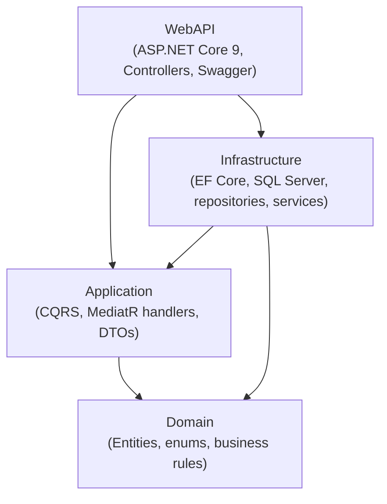
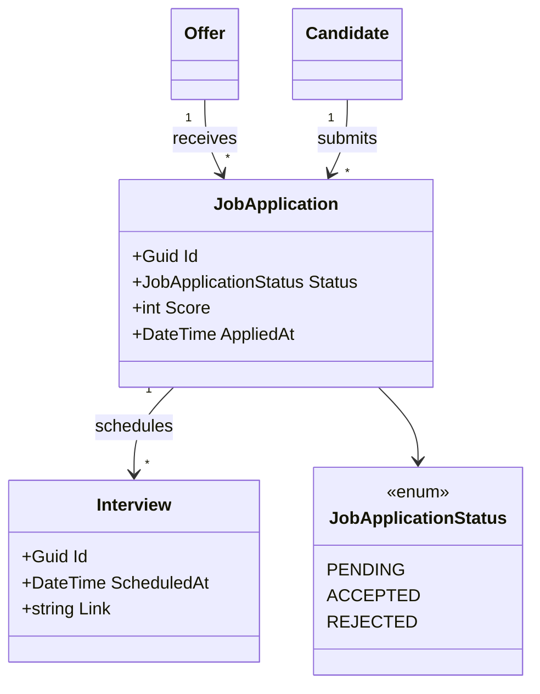

# RecruitProApp — Clean Architecture / DDD / CQRS (.NET 9)

[](https://github.com/abdel-rahmane-anp/recruitpro-clean-architecture/actions/workflows/ci.yml)


A backend **Applicant Tracking System (ATS)** API built to demonstrate a clean, production-oriented **.NET 9** architecture: **Clean Architecture**, **Domain-Driven Design**, **CQRS with MediatR**, **EF Core / SQL Server**, structured logging (**Serilog**) and **OpenTelemetry** tracing — all runnable with a single command.

> This repository is intentionally **backend-only** to keep the focus on architecture and domain design. It is a portfolio project, not a commercial product.

---

## What this project demonstrates

- **Strict layering** with the Clean Architecture dependency rule (the Domain depends on nothing).
- **CQRS** — every use case is an explicit `Command` or `Query` handled by a dedicated MediatR handler.
- **Feature-oriented organisation** by business area (Candidates, Offers, JobApplications, Interviews).
- **Encapsulated entities** (private setters, intent-revealing methods) instead of public data bags.
- **Observability by design** — Serilog structured logs + OpenTelemetry traces, with optional Azure Monitor export.
- **Runnable out of the box** — `docker compose up` spins up SQL Server + the API and applies migrations automatically.

---

## Architecture

Clean Architecture — dependencies point **inward**, toward the Domain.



- **Domain** — pure business model, no external dependency.
- **Application** — orchestrates use cases (commands/queries), defines interfaces (repositories, services).
- **Infrastructure** — implements those interfaces (EF Core persistence, repositories, email).
- **WebAPI** — thin HTTP layer; controllers dispatch to MediatR and return DTOs.

## Domain model



---

## Tech stack

| Concern | Technology |
|---|---|
| Runtime / API | ASP.NET Core 9, REST, Swagger (Swashbuckle) |
| Application | MediatR (CQRS), DTOs |
| Persistence | EF Core 9, SQL Server |
| Logging | Serilog (console + rolling file) |
| Tracing | OpenTelemetry (ASP.NET Core + HttpClient), optional Azure Monitor exporter |
| Testing | xUnit, NSubstitute, AutoFixture, FluentAssertions |
| Tooling | Docker, GitHub Actions (CI) |

---

## Getting started

### Option A — Docker (recommended, one command)

Requires Docker Desktop.

```bash
git clone https://github.com/abdel-rahmane-anp/recruitpro-clean-architecture.git
cd recruitpro-clean-architecture
docker compose up --build
```

This starts SQL Server, builds and runs the API, and applies EF Core migrations automatically.

- Swagger UI: **http://localhost:8080/swagger**

### Option B — Local (.NET SDK)

Requires the .NET 9 SDK and a