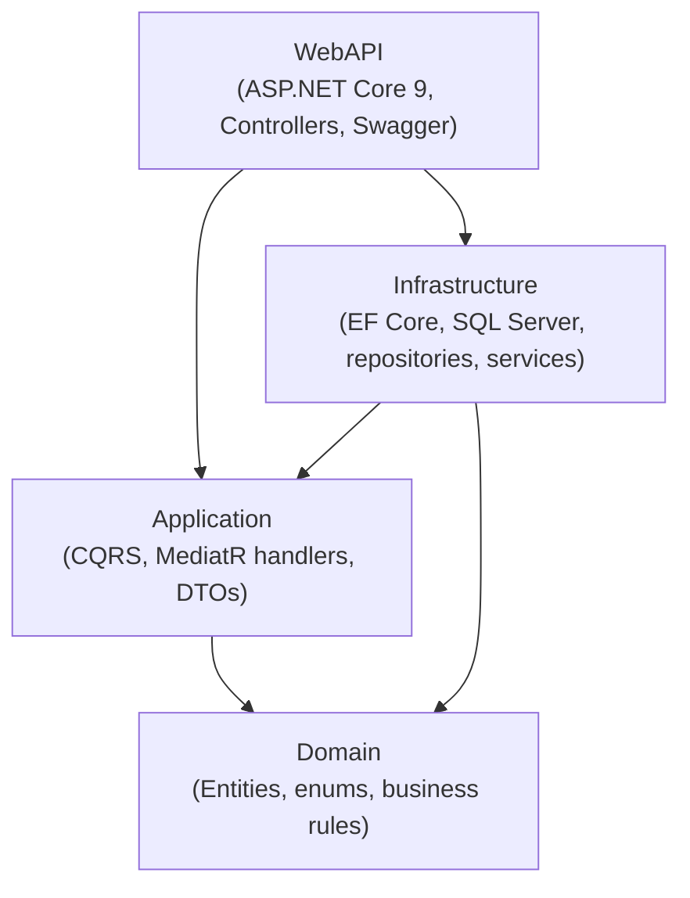
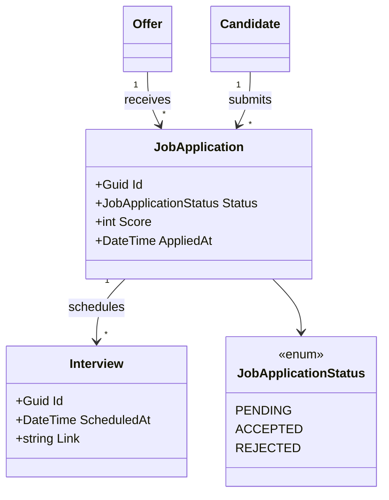

# RecruitProApp — Clean Architecture / DDD / CQRS (.NET 9)

[](https://github.com/abdel-rahmane-anp/recruitpro-clean-architecture/actions/workflows/ci.yml)


A backend **Applicant Tracking System (ATS)** API built to demonstrate a clean, production-oriented **.NET 9** architecture: **Clean Architecture**, **Domain-Driven Design**, **CQRS with MediatR**, **EF Core / SQL Server**, structured logging (**Serilog**) and **OpenTelemetry** tracing — all runnable with a single command.

> This repository is intentionally **backend-only** to keep the focus on architecture and domain design. It is a portfolio project, not a commercial product.

---

## What this project demonstrates

- **Strict layering** with the Clean Architecture dependency rule (the Domain depends on nothing).
- **CQRS** — every use case is an explicit `Command` or `Query` handled by a dedicated MediatR handler.
- **Feature-oriented organisation** by business area (Candidates, Offers, JobApplications, Interviews).
- **Encapsulated entities** (private setters, intent-revealing methods) instead of public data bags.
- **Observability by design** — Serilog structured logs + OpenTelemetry traces, with optional Azure Monitor export.
- **Runnable out of the box** — `docker compose up` spins up SQL Server + the API and applies migrations automatically.

---

## Architecture

Clean Architecture — dependencies point **inward**, toward the Domain.



- **Domain** — pure business model, no external dependency.
- **Application** — orchestrates use cases (commands/queries), defines interfaces (repositories, services).
- **Infrastructure** — implements those interfaces (EF Core persistence, repositories, email).
- **WebAPI** — thin HTTP layer; controllers dispatch to MediatR and return DTOs.

## Domain model



---

## Tech stack

| Concern | Technology |
|---|---|
| Runtime / API | ASP.NET Core 9, REST, Swagger (Swashbuckle) |
| Application | MediatR (CQRS), DTOs |
| Persistence | EF Core 9, SQL Server |
| Logging | Serilog (console + rolling file) |
| Tracing | OpenTelemetry (ASP.NET Core + HttpClient), optional Azure Monitor exporter |
| Testing | xUnit, NSubstitute, AutoFixture, FluentAssertions |
| Tooling | Docker, GitHub Actions (CI) |

---

## Getting started

### Option A — Docker (recommended, one command)

Requires Docker Desktop.

```bash
git clone https://github.com/abdel-rahmane-anp/recruitpro-clean-architecture.git
cd recruitpro-clean-architecture
docker compose up --build
```

This starts SQL Server, builds and runs the API, and applies EF Core migrations automatically.

- Swagger UI: **http://localhost:8080/swagger**

### Option B — Local (.NET SDK)

Requires the .NET 9 SDK and a local SQL Server / LocalDB (Windows). The connection string lives in `appsettings.json`.

```bash
dotnet restore
dotnet run --project src/RecruitProApp.WebAPI
```

Migrations are applied automatically on startup — no manual `dotnet ef database update` needed.

---

## API overview

| Resource | Description |
|---|---|
| `Offers` | Create and query job offers |
| `Candidates` | Create and query candidates |
| `JobApplications` | Submit, accept, reject, score applications |
| `Interviews` | Schedule, reschedule, cancel interviews |

Explore everything interactively via Swagger.

---

## Testing

```bash
dotnet test
```

Unit tests cover the application handlers using **NSubstitute** (mocking) and **AutoFixture** (test-data generation) — no database required, so they run fast in CI.

---

## Project structure

```
recruitpro-clean-architecture/
├── src/
│   ├── RecruitProApp.Domain/          # Entities, enums, repository interfaces (no dependencies)
│   ├── RecruitProApp.Application/     # CQRS commands/queries, handlers, DTOs, interfaces
│   ├── RecruitProApp.Infrastructure/  # EF Core, SQL Server, repositories, services
│   └── RecruitProApp.WebAPI/          # ASP.NET Core 9 controllers, DI, Swagger
├── tests/
│   └── RecruitProApp.Tests/           # xUnit unit tests
├── Dockerfile
├── docker-compose.yml
└── .github/workflows/ci.yml
```

---

## Design decisions & trade-offs

A few deliberate choices — and where this project is heading next:

- **Backend-only scope.** The Angular client was removed from this repository to keep the focus on architecture. The goal here is to showcase domain and application design, not UI.
- **CQRS without over-engineering.** Commands and queries are separated, but they share the same database — no separate read model. Appropriate for this domain size; a read model would be premature.
- **Encapsulated but evolving domain.** Entities already use private setters and behaviour methods. The next iteration moves remaining state-transition logic (e.g. accept/reject) fully **into the aggregates** and introduces **domain events** and **value objects** (see roadmap).
- **Optional observability.** Azure Monitor export is wired only when a connection string is supplied, so the app runs anywhere with zero cloud dependency.

## Roadmap (DDD deepening)

- [ ] Rich aggregate behaviour with guarded state transitions (`Submit`, `Accept`, `Reject`) instead of generic setters
- [ ] `BaseEntity` / `AggregateRoot` base with identity, equality and a domain-events collection
- [ ] Domain events (`JobApplicationSubmitted`, `InterviewScheduled`, …) dispatched via MediatR after `SaveChanges`
- [ ] Value objects (`Email`, `Score`, `MeetingLink`) to remove primitive obsession
- [ ] EF Core mappings via `IEntityTypeConfiguration` to keep persistence concerns out of the Domain

---

## Author

**Abdel Rahmane NJI PAM** — Full Stack Software Engineer (.NET / Angular · Cloud Azure)

[LinkedIn](https://www.linkedin.com/in/abdel-rahmane/) · [Portfolio](https://anp-web-tech.fr)

## License

Released under the [MIT License](LICENSE).
