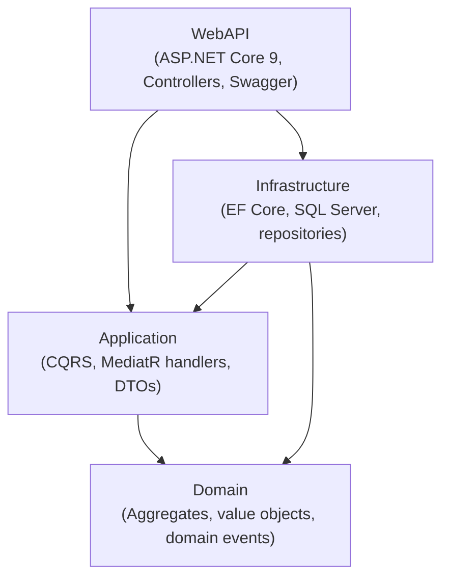
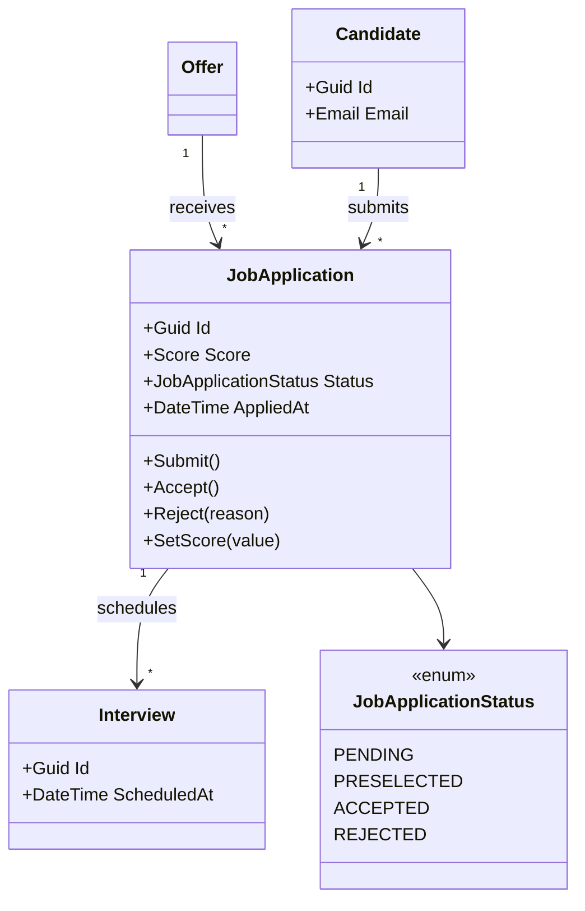

# RecruitProApp — Clean Architecture / DDD / CQRS (.NET 9)

[](https://github.com/abdel-rahmane-anp/recruitpro-clean-architecture/actions/workflows/ci.yml)


A backend **Applicant Tracking System (ATS)** API built to demonstrate a clean, production-oriented **.NET 9** architecture: **Clean Architecture**, **Domain-Driven Design**, **CQRS with MediatR**, **EF Core / SQL Server**, structured logging (**Serilog**) and **OpenTelemetry** tracing — all runnable with a single command.

> This repository is intentionally **backend-only** to keep the focus on architecture and domain design. It is a portfolio project, not a commercial product.

---

## What this project demonstrates

- **Strict layering** with the Clean Architecture dependency rule (the Domain depends on nothing).
- **CQRS** — every use case is an explicit `Command` or `Query` handled by a dedicated MediatR handler.
- **Rich domain model** — aggregates with **guarded state transitions**, **value objects** (`Email`, `Score`) that cannot exist in an invalid state, and **domain events** dispatched via MediatR after the unit of work is committed.
- **Decoupled side effects** — emails are triggered by domain-event handlers, not embedded in the use cases.
- **Consistent error handling** — a global exception handler returns **RFC 7807 ProblemDetails** (`DomainException` → 400, not found → 404).
- **Observability by design** — Serilog structured logs + OpenTelemetry traces, with optional Azure Monitor export.
- **Runnable out of the box** — `docker compose up` spins up SQL Server + the API and applies migrations automatically.

---

## Architecture

Clean Architecture — dependencies point **inward**, toward the Domain.



- **Domain** — pure business model (aggregates, value objects, domain events); no external dependency.
- **Application** — orchestrates use cases (commands/queries) and reacts to domain events; defines interfaces.
- **Infrastructure** — implements those interfaces (EF Core persistence, repositories) and dispatches domain events.
- **WebAPI** — thin HTTP layer; controllers dispatch to MediatR and return DTOs.

## Domain model



`JobApplication` is the aggregate root: state changes only happen through its methods, which enforce the rules and raise domain events. `Email` and `Score` are value objects that validate themselves on construction.

---

## Tech stack

| Concern | Technology |
|---|---|
| Runtime / API | ASP.NET Core 9, REST, Swagger (Swashbuckle) |
| Application | MediatR (CQRS + notifications) |
| Persistence | EF Core 9, SQL Server (value converters for value objects) |
| Error handling | RFC 7807 ProblemDetails (global exception handler) |
| Logging | Serilog (console + rolling file) |
| Tracing | OpenTelemetry (ASP.NET Core + HttpClient), optional Azure Monitor exporter |
| Testing | xUnit, NSubstitute, AutoFixture, FluentAssertions |
| Tooling | Docker, GitHub Actions (CI) |

---

## Getting started

### Option A — Docker (recommended, one command)

Requires Docker Desktop.

```bash
git clone https://github.com/abdel-rahmane-anp/recruitpro-clean-architecture.git
cd recruitpro-clean-architecture
docker compose up --build
```

This starts SQL Server, builds and runs the API, and applies EF Core migrations automatically.

- Swagger UI: **http://localhost:8080/swagger**

### Option B — Local (.NET SDK)

Requires the .NET 9 SDK and a local SQL Server / LocalDB (Windows). The connection string lives in `appsettings.json`.

```bash
dotnet restore
dotnet run --project src/RecruitProApp.WebAPI
```

Migrations are applied automatically on startup — no manual `dotnet ef database update` needed.

---

## API overview

| Resource | Description |
|---|---|
| `Offers` | Create and query job offers |
| `Candidates` | Register and query candidates |
| `JobApplications` | Submit, accept, reject, score applications (with guarded transitions) |
| `Interviews` | Schedule, reschedule, cancel interviews |

Invalid operations (e.g. accepting a rejected application, an out-of-range score, a malformed email) return a clean **400 ProblemDetails** response rather than a 500.

## Screenshots

> _Add a screenshot or GIF of the Swagger UI here, e.g. `docs/swagger.png`:_
>
> ``

---

## Testing

```bash
dotnet test
```

Unit tests cover domain invariants (aggregate transitions, value objects) and application handlers, using **NSubstitute** (mocking) and **AutoFixture** (test-data generation) — no database required, so they run fast in CI.

## Project structure

```
recruitpro-clean-architecture/
├── src/
│   ├── RecruitProApp.Domain/          # Aggregates, value objects, domain events (no dependencies)
│   ├── RecruitProApp.Application/     # CQRS handlers, domain-event handlers, DTOs, interfaces
│   ├── RecruitProApp.Infrastructure/  # EF Core, SQL Server, repositories, event dispatch
│   └── RecruitProApp.WebAPI/          # Controllers, DI, Swagger, global exception handler
├── tests/
│   └── RecruitProApp.Tests/           # xUnit unit tests
├── Dockerfile
├── docker-compose.yml
└── .github/workflows/ci.yml
```

---

## Design decisions & trade-offs

- **Backend-only scope.** The Angular client lives elsewhere; this repository focuses on domain and application design.
- **Rich aggregate over anemic model.** Business rules live inside `JobApplication` (e.g. a rejected application can no longer change state), not in a service. Side effects are handled by domain-event handlers, keeping use cases focused.
- **Value objects with EF value converters.** `Email` and `Score` map to the existing columns, so encapsulation is added with **no schema migration**.
- **CQRS without over-engineering.** Commands and queries are separated but share the same database — no separate read model, which would be premature for this domain size.
- **Optional observability.** Azure Monitor export is wired only when a connection string is supplied, so the app runs anywhere with zero cloud dependency.

## Roadmap

- [x] Rich aggregate behaviour with guarded state transitions (`Submit`, `Accept`, `Reject`)
- [x] `AggregateRoot` base with a domain-events collection
- [x] Domain events dispatched via MediatR after `SaveChanges`
- [x] Value objects (`Email`, `Score`) to remove primitive obsession
- [x] Global exception handling with RFC 7807 ProblemDetails
- [ ] `MeetingLink` value object on `Interview`
- [ ] EF Core mappings via dedicated `IEntityTypeConfiguration` classes
- [ ] Request validation (FluentValidation) and JWT authentication

---

## Author

**Abdel Rahmane NJI PAM** — Full Stack Software Engineer (.NET / Angular · Cloud Azure)

[LinkedIn](https://www.linkedin.com/in/abdel-rahmane/) · [Portfolio](https://anp-web-tech.fr)

## License

Released under the [MIT License](LICENSE).
